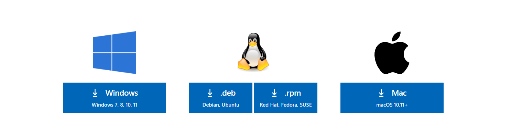
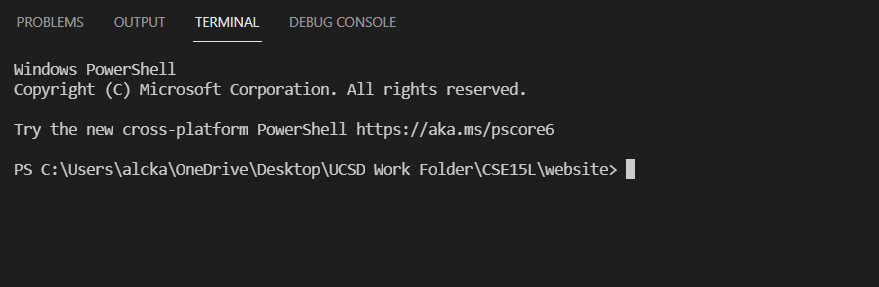
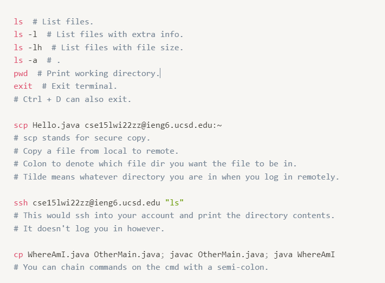
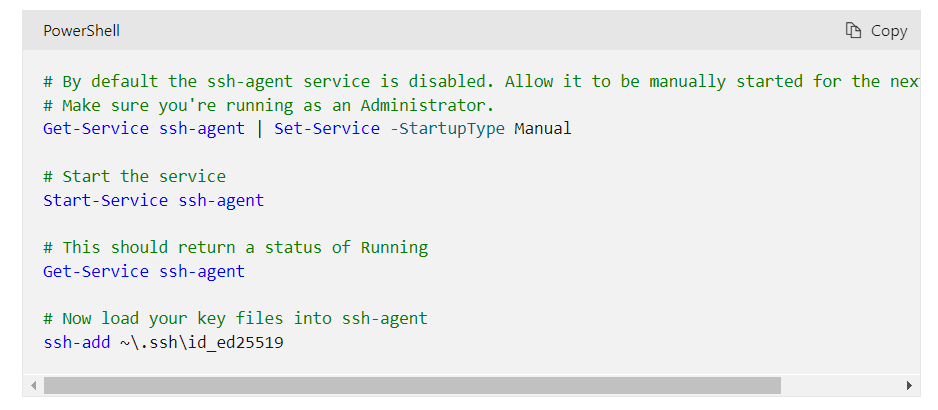
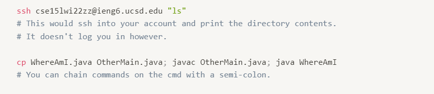

# Lab Report 1 Week 2 - Week 1 Summary

<p align="center">
    This is a cat with an afro!
    <br>
  
</p>

<br>

## __Installing VSCode__
Navigate to [here](https://code.visualstudio.com/Download). 


_Figure 1: Downloading VSCode._

The link should direct you to a page with an interface similar to the above. Then download the VSCode corresponding to your OS. Follow the default steps and the installation should be finished. This should be a simple process. 

## __Remotely Connecting__
To remotely connect is a complicated process. First, navigate over to account lookup [here](https://sdacs.ucsd.edu/~icc/index.php) and find your corresponding class ieng6 account. It should be something like "cse15lwi22abc@ieng6.ucsd.edu". The letters "abc" should be replaced with the 3 letters in your cse15l ieng6 account. Reset your password. Once you have reset your password, navigate over to the terminal in VSCode. To get to the terminal, click "Terminal" at the top and select "New Terminal". It should look something like the below: 


_Figure 2: Opening terminal._

Then you want to type in `ssh cse15lwi22abc@ieng6.ucsd.edu` with "abc" replaced with your 3 letters as mentioned above. The `ssh` command is for logging into __remote servers__ or machines. These are basically computers that you don't have sitting in front of you. Your computer is the local machine or the __client__. Running the command is as simple as typing it out and then hitting Enter. It will then prompt you for a password (which should be the new password after your password reset from above). That's it!

## __Trying Some Commands__

Now let's try some commands! To clarify, in general and from what I understand now, the __terminal__ is another word for __command line__ or __command prompt__ or __shell__. If you are on Windows like me, we are locally on a Windows PowerShell when we open up the terminal in VSCode. However, after we connect to the ieng6 machines, we are in a different environment because the remote servers have a different OS. Windows and Linux shells share similar commands but have some differences. In this blog, we are covering the commands for Linux. 


_Figure 3: A few basic commands._

Of course, all the above commands are meant to be ran in your remote machine except for 2: the `scp` and `ssh` commands, which should be ran locally.
These commands are straightforward and I advise you to further play around with the ones you are most unsure about.

## __Moving Files with scp__

As seen in the previous section on commands, the `scp` securely copies (as the command suggests) a file from your local machine to a remote machine.

```
$ scp Hello.java cse15lwi22zz@ieng6.ucsd.edu:~
```
_Figure 4: The `scp` command._


In the above example, we are simply copying the Hello.java in our current local directory to the default directory in the remote machine (as signified by the tilde).

Then you can use the `ls` command to check that you successfully copied to file over to the remote machine.


_Figure 5: Checking if the `scp` command worked._

## __Setting an SSH Key__

This is even more complicated than remotely connecting. First, you want to type into your local VSCode terminal, `ssh-keygen`. You want to specify where you want to store the private and public keys (somewhere safe). For pass phrase, you want to skip those queries. We are setting up an SSH Key so that we don't need to enter our password every time we log in (and not enter _this_ pass phrase either!).This will generate a _public_ and a _private_ key (the public key will be the file with the `.pub` extension). Then, if you are on Windows, follow the extra steps [here](https://docs.microsoft.com/en-us/windows-server/administration/openssh/openssh_keymanagement#user-key-generation). For Windows users, this part can be a bit confusing. So here's a simplification.


_Figure 6: Extra Steps for Windows Users._

You want to run VSCode as an administrator (this means simply closing it now and right clicking VSCode on your desktop and pressing "Run as Administrator"). Run the first 3 commands in Figure 6 as normal. The fourth command, you should specify the full path to the keys as shown in the image. The file is most likely named `id_rsa` instead of `id)ed25519`. Once you have done that, `ssh` into your remote machine, and make a `.ssh` folder: `mkdir .ssh`. Then log out. Now, use the `scp` command to securely copy the `id_rsa.pub` (_public_ key) to the "~/.ssh/authorized_keys/" folder on the remote machine.

```
$ scp /Users/your_user/.ssh/id_rsa.pub cs15lwi22abc@ieng6.ucsd.edu:~/.ssh/authorized_keys
```
_Figure 7: Copying the public key to the remote machine._

After this, you should be able to `ssh` into your remote machine without a password!

## __Optimizing Remote Running__

At some point, you want to run things quickly and not have to retype things out. This is a simple task compared to setting up the SSH Key. You can press the Up Arrow Key on your keyboard when you are in the terminal to go to the previous command. 


_Figure 8: Shortcut commands._

Additionally, you can, as in Figure 8, run basic commands after you `ssh`. These commands were shown in an earlier section in this blog. Furthermore, you can copy multiple files (and securely copy multiple files). You can delimit multiple commands with the semicolon. So an example series of commands would be:

```
$ scp WhereAmI.java cs15lwi22adz@ieng6.ucsd.edu:~; ssh cs15lwi22adz@ieng6.ucsd.edu
$ javac WhereAmI.java; java WhereAmI
```
_Figure 9: Sample commands._

Normally, you would secure copy your file from your local machine to the remote server and enter your password while at it. Then, you would `ssh` into the remote server, compile the java file, and run it. Let's consider the worst case and compare it to our optimized method! 

### __Worst Case__
Let's say you have the `scp` command copied (with a new linebreak so the command automatically runs after pasting). Then we have 4 keystrokes: copying and pasting the command in (Ctrl + C, Ctrl + V). Without an SSH key, you would need to type in your password when you use the `scp` command. This is (_N_ * _i_) keystrokes where _N_ is the number of keystrokes for your password plus the enter key and _i_ is the number of times you had to try typing and entering your password. Then, we need to `ssh` into our remote server. Assuming you have the command stored somewhere, you copy and paste it into the terminal resulting in another 4 keystrokes (Ctrl + C, Ctrl + V). Without an SSH key, you must perform (_N_ * _j_) keystrokes. Once logged in, we must copy and paste both the compile and run commands for our java file. This is a total of 8 keystrokes. With this process in place, we have roughly [16 + (_N_ * _i_) + (_N_ * _j_) + _k_] keystrokes. 16 keystrokes under the constraint that we have our commands stored somewhere. _N_ keystrokes for our password (which includes the enter key) and (_N_ * _i_) amount of keystrokes where _i_ represents how many times you had to try typing in your password. Finally, you have _k_ extra keystrokes for errors. Not to mention, we have the chance of failing our authentication and thus timing out!

$$
\begin{array}{ll}
  k_{worst} & = \quad e_{scp} \hspace{11em} (Eq.~1)\\
  & \quad\quad +~e_{ssh} \\
  & \quad\quad +~e_{javac} \\
  & \quad\quad +~e_{java} \\
  & \quad\quad +~e_{remote\_nav} \\
  & \quad\quad +~e_{local\_nav} \\
\end{array} \\

{} \\

\begin{equation*}
where \left\{
        \begin{array}{ll}
            e_{scp} & \quad errors~in~scp~cmd~execution \\
            e_{ssh} & \quad errors~in~ssh~execution \\
            e_{javac} & \quad
            errors~in~compile~execution \\
            e_{java} & \quad
            errors~in~file~execution \\
            e_{remote\_nav} & \quad keystrokes~in~remote~navigation \\
            e_{local\_nav} & \quad keystrokes~in~local~navigation \\
        \end{array}
    \right.
\end{equation*} \\

{} \\

T_{worst} = 16 + (N * i) + (N * j) + k_{worst} \hspace{1em} (Eq.~2) \\ 
subject~to~no~time~out
$$

### __Our Optimized Case__

On the contrary, our series of optimized commands (paired with an SSH Key with no passphrase) illustrated in Figure 9 leads to a total of 8 keystrokes (Ctrl + C, Ctrl + V) for copying and pasting the both sets of commands.

$$
\begin{array}{ll}
  k_{optimized} & = \quad e_{scp\_ssh} \hspace{8em} (Eq.~3)\\
  & \quad\quad +~e_{javac\_java} \\
\end{array} \\

{} \\

\begin{equation*}
where \left\{
        \begin{array}{ll}
            e_{scp\_ssh} & \quad errors~in~scp~and~ssh~cmd~execution \\
            e_{javac\_java} & \quad errors~in~javac~and~java~execution \\
        \end{array}
    \right.
\end{equation*} \\

{} \\

T_{optimized} = 8 + k_{optimized} \hspace{7em} (Eq.~4) \\
$$

As such, we save 8 + (_N_ * _i_) + (_N_ * _j_) keystrokes and we have a lot less room for error! Plus, we don't have any constraint anymore!