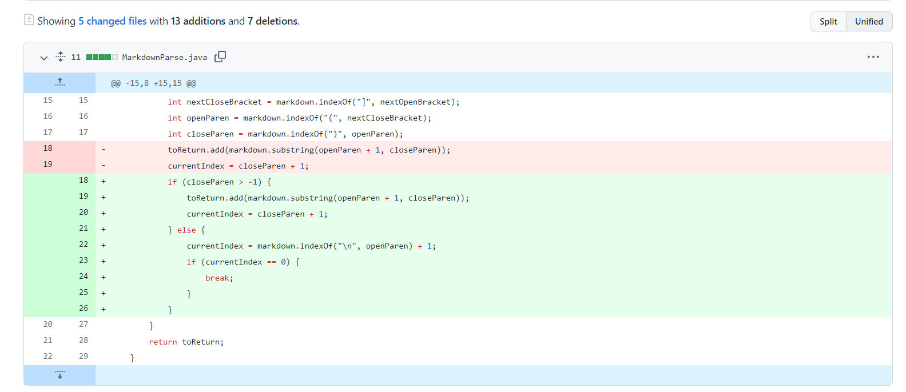
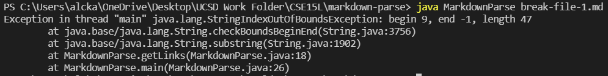
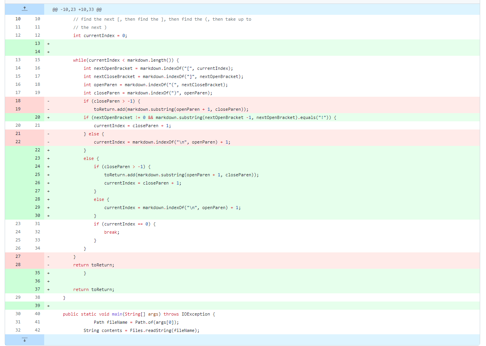
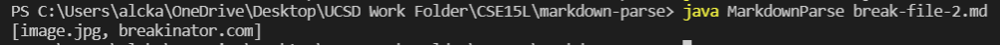
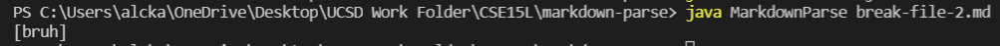

# Lab Report 2 Week 2 - Testing Code

    This is a cat with an afro!
     
  

 

## __Code Change 1__

_Figure 1. Code change 1._

_Figure 2. Code change 1 symptom of failure-inducing input._

[Here](https://raw.githubusercontent.com/alckasoc/markdown-parse/main/mytestfile.md) is the first break file. The bug here is that the program doesn't account for the closing parentheses. The symptom that we can observe is the `StringIndexOutOfBoundsException` error in the terminal. Because the previous code (before code change 1) couldn't account for the closing parentheses, the contents of the while loop were subjected to run indefinitely. Specifically, because `closeParen` would be -1, the `substring` method would range from `openParen + 1` to `-1`. This causes the error. Our input was fine except for a small _intention_ problem: we removed the closing parentheses for 1 link.

## __Code Change 2__

_Figure 3. Code change 2 & 3._

_Figure 4. Code change 2 symptom of failure-inducing input._

[Here](https://raw.githubusercontent.com/alckasoc/markdown-parse/main/mytestfile2.md) is the second break file. Figure 3 contains code change 2 and code change 3. There were a few hiccups and versioning issues in how our lab handled collaborative testing. I believe a clearer framework for how we tackle the collaborative testing should be in place (i.e. set guidelines and practices to follow when collaborating). In general, code change 2 results from an input with both an image and a file link. Figure 4, the symptom, demonstrates the naive method which fails to differentiate between the image and the link. The bug here is that our naive method doesn't account for images when it searches for links. Our code at line 20 tackles that exact problem. 

## __Code Change 3__

_Figure 5. Code change 2 & 3._

_Figure 6. Code change 3 symptom of failure-inducing input._

[Here](https://raw.githubusercontent.com/alckasoc/markdown-parse/main/mytestfile3.md) is the third break file. Our 3rd code change was a crucial design choice. Our code change is in Figure 5 lines 22-30. We had solved both problems in code change 1 & 2, however, we found it important to structure our solutions such that they were compatible and seamless with one another. The bug here is more of a general question: how do we organize the code. Symptoms of this kind of bug are more subtle and deadlier downstream when images and links aren't specially handled, for instance. Symptoms could be in the form of incorrect handling of images or links. The input file linked above is another case where there is a missing parentheses. In this case, it is a missing open bracket. Our program has a great deal of room for improvement. However, it does implicitly solve this task in just how the organization of the if statements is dictated. Because the inner if statement within the `else` is not dependent on the `NextOpenBracket` variable, it implicitly and automatically finds the 2nd link and parses that link. Though not thorough, this specific organization allowed the code to pass this test case.

