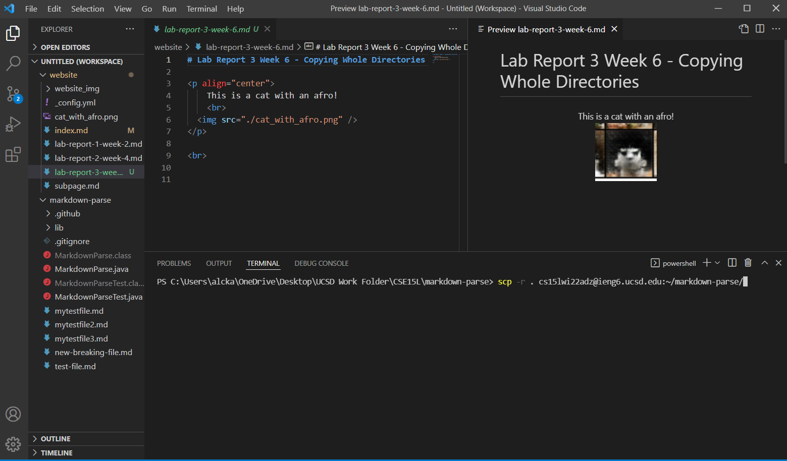
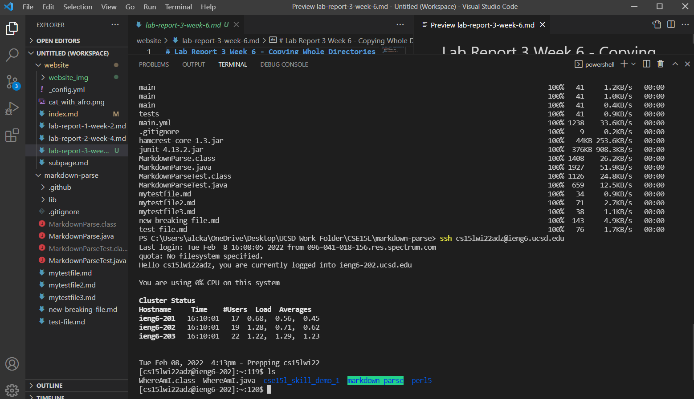
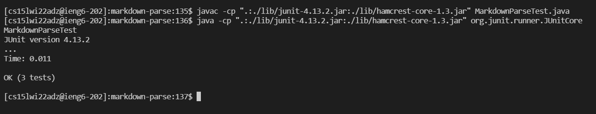
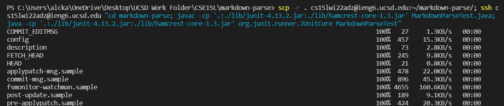

# Lab Report 3 Week 6 - Copying Whole Directories

    This is a cat with an afro!
     
  

 

# ____

Figure 1. Calling `scp` on the entire `markdown-parse` directory.

Here we essentially copy over all the contents of the folder `markdown-parse` to another folder called `markdown-parse` on our remote server. On the left hand side, I included the folder directories of markdown-parse and the website.

Figure 2. Checking for `markdown-parse` contents.

Here we are checking that we successfully copied over the `markdown-parse` contents. Note, it is important to copy the contents of your local machine's folder into _another_ folder on the remote server (instead of simply specifying `~`). This is because it will copy the content's of your local machine's folder into `~` without creating a folder to store it all in. I found this out from testing!

Figure 3. Running JUnit remotely.

Here we run JUnit in our remote server. Note, we use colons instead of semi-colons in Linux! This was the nuance that troubled this step the most.

Figure 4. Combining commands.

In Figure 4, we combine commands to streamline the remote JUnit testing process for our `markdown-parse` code. This makes for a faster testing process (that is, if we wanted to run it remotely on ieng6).
