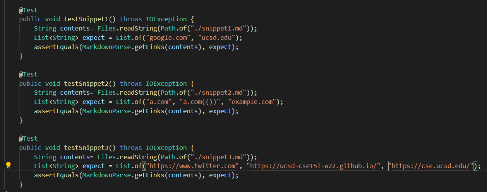
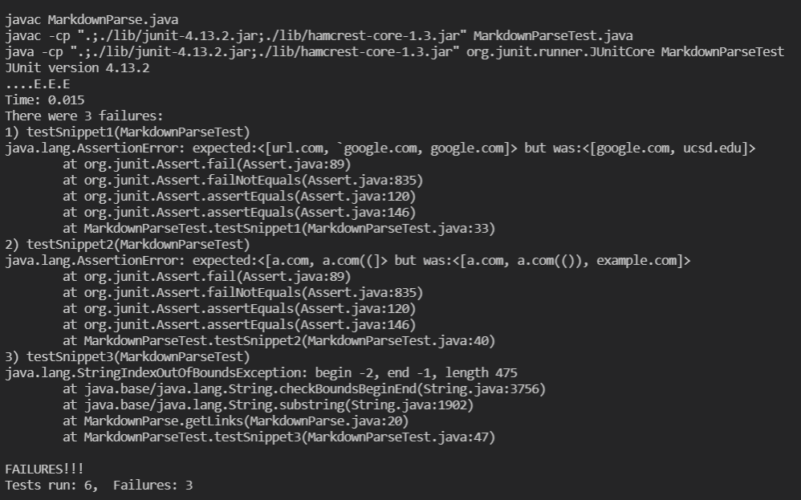
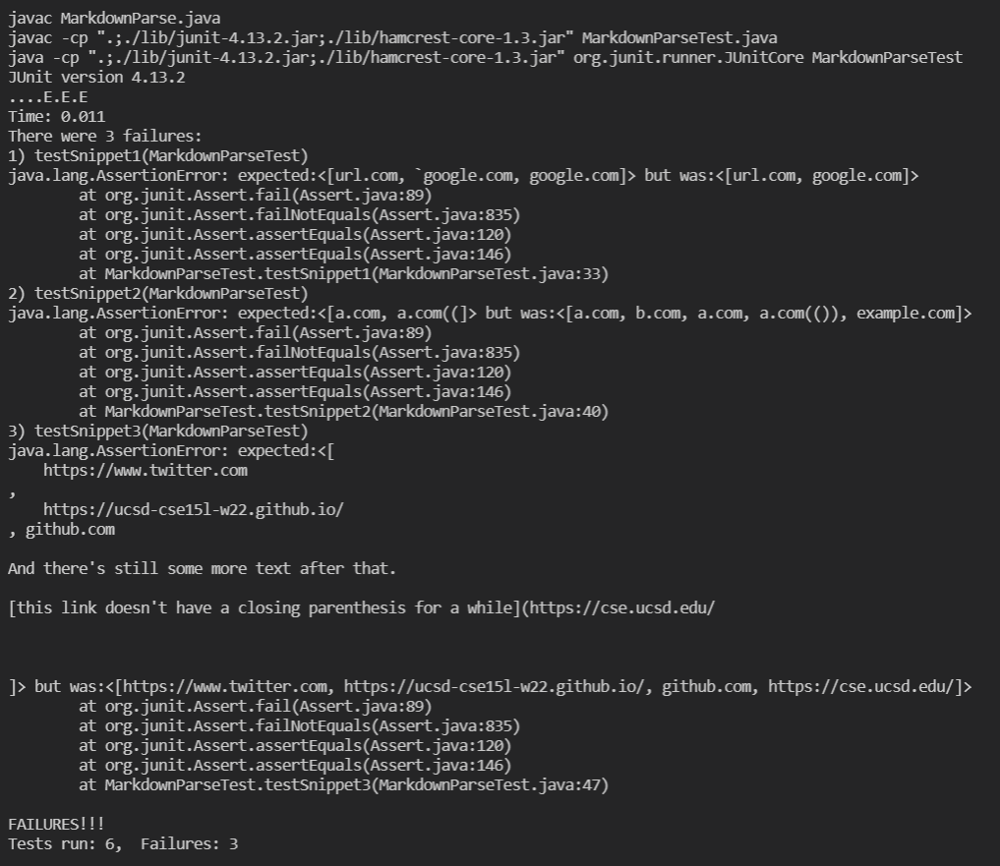

# Lab Report 4 Week 8 - Copying Whole Directories

    This is a cat with an afro!
     
  

 

# Results

Link to our markdown parse: [here](https://github.com/alckasoc/markdown-parse).  
Link to their markdown parse: [here](https://github.com/ajwboi/markdown-parse).

_Figure 1. Implementation of the tests for the 3 snippets._

_Figure 2. Our implementation results on the 3 tests._

_Figure 2. Our implementation results on the 3 tests._

# Questions

Do you think there is a small (<10 lines) code change that will make your program work for snippet 1 and all related cases that use inline code with backticks? If yes, describe the code change. If not, describe why it would be a more involved change.

 
I think this would require a more elaborate code change because our current implementation relies heavily on the the `nextOpenBracket` and `nextCloseBracket`. With these variables dictating much of how the rest of the statements in the while loop execute, this would require careful reshuffling and change.

 

Do you think there is a small (<10 lines) code change that will make your program work for snippet 2 and all related cases that nest parentheses, brackets, and escaped brackets? If yes, describe the code change. If not, describe why it would be a more involved change.

 
For snippet 2, I think a simple stack and if-statement checker for backslashes preceding brackets can be implemented to solve the case. This would also include something that takes into account nested links. As such, I think we can do this in < 10 lines of code changes.

 

Do you think there is a small (<10 lines) code change that will make your program work for snippet 3 and all related cases that have newlines in brackets and parentheses? If yes, describe the code change. If not, describe why it would be a more involved change.

 
This one would probably require less than 10 lines of code changes. To solve this case, we would just need something to check for an incoming end parentheses before we reach a new "link". This would most likely come in the form of a few if statements.

 