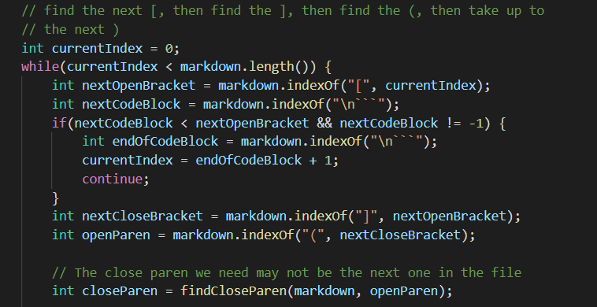

# Lab Report 5 Week 10 - Comparing Implementations

    This is a cat with an afro!
     
  

 

# Approach

I ran the implementation provided in lab 9 to generate an output file. I then ran my implementation on single `.md` files to compare results and source differences. 2 cases I found are `511.md` and `533.md`. 

# `511.md` Case

`511.md`, in our implementation, yields an empty list `[]`. In the reference implementation, it yields the output: `[/uri]`. The expected output is `[/uri]` so the reference implementation is correct.  Our implementation is incorrect because it doesn't take into account the nested square brackets. It finds the opening square bracket, then the following closing square bracket without taking into account if there would be more opening square brackets proceeding the initial one. For a problem like this, we would need some sort of helper method to check for valid parentheses.

_Figure 1. The code snippet resulting in incorrect output for `511.md`._

In Figure 1, I detail the code snippet in our implementation that needs to be edited to account for these nested square brackets.

# `533.md` Case

`533.md`, in our implementation, yields an infinite loop. In the reference implementation, it yields the output: `[]`. Neither implementation is correct because the expected output is `[/uri]`. Our implementation yields an infinite loop for this case because of our helper method. 

_Figure 2. The code snippet resulting in incorrect output for `533.md`._

Our helper method, shown in Figure 2, will not take into account that there are no parentheses at all in this file.

